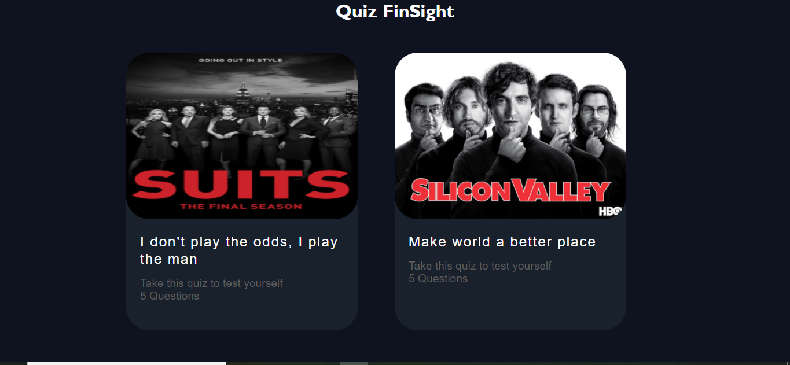

<!--
*** Thanks for checking out my Project. If you have a suggestion
*** that would make this better, please fork the repo and create a pull request
*** or simply open an issue with the tag "enhancement".
*** Don't forget to give the project a star!
*** Thanks again! Now go create something AMAZING! :D
-->

<!-- PROJECT SHIELDS -->

[![Issues][issues-shield]](https://github.com/Asuraking1n/quiz-p0-screens/pulls)
[![LinkedIn][linkedin-shield]](https://www.linkedin.com/in/nishant-kumar-tiwari-253a46196/)

<!-- PROJECT LOGO -->
 

  

 

  <h3 align="center">Best-Quiz-Screen-Template</h3>

  

    An awesome Quiz Screens to jumpstart your Quiz projects!
     
     
    <a href="https://musing-golick-20ea06.netlify.app/">View Demo</a>
    ·
    <a href="https://github.com/Asuraking1n/quiz-p0-screens/issues">Report Bug</a>
    ·
    <a href="https://github.com/Asuraking1n/quiz-p0-screens/issues">Request Feature</a>
  

<!-- ABOUT THE PROJECT -->
## About The Project

This is UI of Screens for an Quiz Project,Hope you guys like it.

### Built With

* [HTML](https://www.w3schools.com/html/)
* [CSS](https://www.w3schools.com/css/)

(<a href="#top">back to top</a>)

<!-- GETTING STARTED -->

### Prerequisites

You don't need anything special, just download the screens.

## Usage

Well, You can use these screens in your Quiz Project

<!-- ROADMAP -->

## Contributing

Contributions are what make the open source community such an amazing place to learn, inspire, and create. Any contributions you make are **greatly appreciated**.

If you have a suggestion that would make this better, please fork the repo and create a pull request. You can also simply open an issue with the tag "enhancement".
Don't forget to give the project a star! Thanks again!

1. Fork the Project
2. Create your Feature Branch (`git checkout -b feature/AmazingFeature`)
3. Commit your Changes (`git commit -m 'Add some AmazingFeature'`)
4. Push to the Branch (`git push origin feature/AmazingFeature`)
5. Open a Pull Request

(<a href="#top">back to top</a>)

<!-- LICENSE -->

<!-- CONTACT -->
Nishant Kumar Tiwari - [@my_Linkedin](https://www.linkedin.com/in/nishant-kumar-tiwari-253a46196/) - nishant88tiwari@gmail.com

Project Link: [Quiz Screens](https://github.com/Asuraking1n/quiz-p0-screens/)

(<a href="#top">back to top</a>)

<!-- MARKDOWN LINKS & IMAGES -->

[issues-shield]: https://img.shields.io/github/issues/othneildrew/Best-README-Template.svg?style=for-the-badge

[linkedin-shield]: https://img.shields.io/badge/-LinkedIn-black.svg?style=for-the-badge&logo=linkedin&colorB=555

